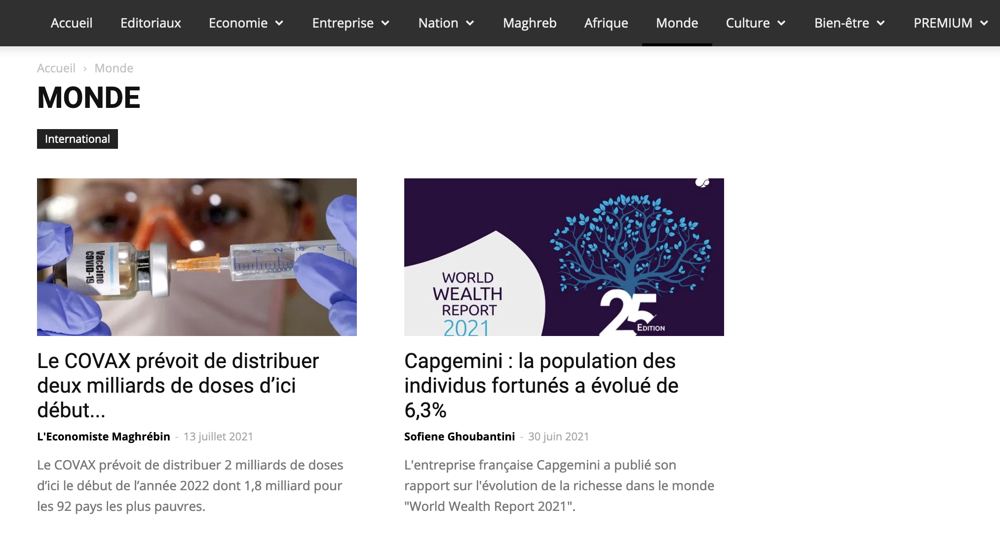

```{r setup, include=FALSE}
# Basic packages
library(knitr)
library(rzine)
library(dplyr)
library(ggplot2)

# text mining packages
library(quanteda)
library(tidytext)
library(readtext)

## Global options
options(max.print="75")
opts_chunk$set(echo=TRUE,
	             cache=FALSE,
               prompt=FALSE,
               tidy=FALSE,
               comment=NA,
               message=FALSE,
               warning=FALSE,
               class.source="bg-info",
               class.output="bg-warning")

# opts_knit$set(width=75)
```


# Introduction {-}

# DATA COLLECTION

## Importation of RSS


### The Mediacloud database

(tbd : presentation of the MediaCloud project)

Mediacloud can be freely used by researchers. All you have to do is to create an account at the following adress :

https://explorer.mediacloud.org


You have different ways to get title of news. We will focus here on a simple example of data obtained through the mediacloud interface. We suppose that you want to extract news from the Tunisian newspapers speaking from Europe.


### Selection of media with source manager

We use the application called *Source Manager* and we introduce a research by collection which is the most convenient to explore what is available in a country. In our example, the target country is Tunisia and we have three collections that are propsed : 

```{r, echo=FALSE}
knitr::include_graphics("figures/mc_source_001.png")
```

We have selected the collection named "Tunisia National" because we are interested in the most important newspapers of the country. 

```{r, echo=FALSE}
knitr::include_graphics("figures/mc_source_002.png")
```
The buble graphic on the right indicates immediately the media that has produced the highest number of news, but it is wise to explore in more details the list on the left which indicates for each media the statting date of data collection. 

When a media appears interesting, we click on its name to obtain a brief summary of the metadata. For example, in the case of *L'économiste Maghrebin* the metadata indicates :

```{r, echo=FALSE}
knitr::include_graphics("figures/mc_source_003.png")
```

The media looks promising,  but before to go further, it can be better to have a look at the website of the media to have a more concrete idea of the content if we don't know in advance what it is about in terms of content, what is the ideological orientation, etc. 


```{r, echo=FALSE}

```

Here we can see that this is an ecnomic journal, published in french, with news organized in concentric geographic circles (Nation > Maghreb > Africa > World) which is precisely what we are looking for in the IMAGEUN project. We will further complete the informations about this, but before to do that we have to check in more details if the production of the media is regular through time with another tool offered by mediacloud, the explorer.

### Checking the stability through time

We have clicked on *search in explorer* on the metadata page of the Source Manager and obtain a news interfacce where we modify the date to cover the full period of collection of the media (or our period of interest). In the research field, we let the search term `*` which indicates a research on all news.

```{r, echo=FALSE}
knitr::include_graphics("figures/mc_explo_001.png")
```


Below your request, you obtain a graphic entitled *Attention Over Time* with the distribution of the number of news published per day which help you to verify if the distribution of news is regular through time. You just have to modify the type of graphic in order to visualize *Story Count* and you can choose the time span you want (day, week or month) for the evaluation of the regularity of news flow. In our example, we notice that at daily level they are some brief period of break in 2019, but the flow is reasonnabely regular with approximatively 5 news per day at the beginning and 10 to 20 in the final period. We also notice a classical week cycle with a decrease of news published during the week-end. 

```{r, echo=FALSE}
knitr::include_graphics("figures/mc_explo_002.png")
```

Going down, you will find a news panel entitled *Total Attention* which gives you the total number of stories found. In our example, we have a total of 13626 stories produced by our media over the period.


### Selection of news specifically related to a topic (option)

You can eventually use Mediacloud to check the number of news produced about a specific topic, for example Europe or European Union or EU. The request shouldbe put in lower case with "" for compounds. Detailed explanation are available in the [query guide](https://mediacloud.org/support/query-guide).

```{r, echo=FALSE}
knitr::include_graphics("figures/mc_explo_003.png")
```
This time you can use the graphic option *Stories percentage* rather than *Story count* if you want to viusalize the salience of the topic through time.

```{r, echo=FALSE}
knitr::include_graphics("figures/mc_explo_004.png")
```

In our example, we have 369 news that appears to be related to our request about Europe or EU with a relatively regular pattern at month level of 1 to 3 \% of news and exceptionaly 5 to 7 \%.

### Download and storage of news

According to your selection (all news or a specific topic) you will download more or less title. Here, me make the choice to get all news, which means that we have to repeat the original request with `*`.

Finally, by clicking on the button *Download all story URLS*, you can get a .csv file that you can easily load in your favorite programming language as we will see in the next section.

## Corpus creation 

```{r}


knitr::opts_chunk$set(cache = TRUE,
                      echo = TRUE,
                      comment = "")


```

In the previous section (ref...) whe have obtained a .csv file of news collected from MediaCloud. We will try now to put this data in a standard form and we have chosen the format of the `quanteda` package as reference for data organization and storage. 

But of course the researchers involved in the project can prefer to use other R packages like `tm` or `tidytext`. And they can also prefer to use another programming language for Python. It is the reason why we explain how to transform and export the data that has been prepared and harmonized with quanteda in various format like .csv or JSON. 


We detail here an example of importation with the example of the newspaper "L'économiste maghrebin"

### Importation of text to R

This step is not always obvious because many problems of encoding can appear that are more or less easy to solve. In principle , the data from Media Cloud are exported in standard `UTF-8` but as we will see it is not necessary the case. 

We try firstly to use the standard R function `read.csv()`: 

```{r loadcsv, echo=TRUE}
store <- "data"
media <- "fr_TUN_ecomag"
type <-".csv"

fic <- paste(store,"/",media,type,sep="")

df<-read.csv(fic,
             sep=",",
             header=T,
             encoding = "UTF-8",
             stringsAsFactors = F)
kable(head(df))
```

The importation was successfull for 12794 news but message of errors appeared for 3 news where R sent a message of error telling :

`Error in gregexpr(calltext, singleline, fixed = TRUE) : regular expression is invalid UTF-8`

Looking in more details, we discover also some problems of encoding in news like in the following example where the text of the news appears differently if we apply the standard functions `paste()` o0 the specialized function r `knitr::kable` for printing. 

```{r}
paste(df[9, 3])
kable((df[9,3]))
```

 
### Resolution of encoding problems

It is sometime possible to adapt manually the encoding problem whan they are not too much as in present example. 

```{r}
df$text<-df$title
# standardize apostrophe
df$text<-gsub("&#8217;","'",df$text)

# standardize punct
df$text<-gsub('&#8230;','.',df$text)

# standardize hyphens
df$text<-gsub('&#8211;','-',df$text)

# Remove quotation marks
df$text<-gsub('&#171;&#160;','',df$text)
df$text<-gsub('&#160;&#187;','',df$text)
df$text<-gsub('&#8220;','',df$text)
df$text<-gsub('&#8221;','',df$text)
df$text<-gsub('&#8216;','',df$text)
df$text<-gsub('&#8243;','',df$text)

```


We can introduce other cleaning procedures here or keep it for later analysis


### Transformation in quanteda format

We propose  a storage based on `quanteda` format by just transforming the data that has been produced by readtext. We keep only the name of the source and the date of publication. 

```{r create quanteda, echo=T}

# Create Quanteda corpus
qd<-corpus(df,docid_field = "stories_id")


# Select docvar fields and rename media
qd$date <-as.Date(qd$publish_date)
qd$source <-media
docvars(qd)<-docvars(qd)[,c("source","date")]


# Add global meta
meta(qd,"meta_source")<-"Media Cloud "
meta(qd,"meta_time")<-"Download the 2021-09-30"
meta(qd,"meta_author")<-"Elaborated by Claude Grasland"
meta(qd,"project")<-"ANR-DFG Project IMAGEUN"

```


We have created a quanteda object with a lot of information stored in various fields. The structure of the object is the following one

```{r, echo=TRUE}
str(qd)
```

We can look at the first titles with *head()*

```{r, echo=TRUE}
kable(head(qd,3))
```


We can get meta information on each stories with *summary()*

```{r, echo=TRUE}
summary(head(qd,3))
```

We can get meta information about the full document

```{r, echo=TRUE}
meta(qd)
```


### Storage of the quanteda object

We can finally save the object in .RDS format in a directory dedicated to our quanteda files. It can be usefull to give some information in the name of the file

```{r, echo=TRUE}
store <- "data"
type<- ".RDS"
myfile <- paste(store,"/",media,type,sep="")
myfile
saveRDS(qd,myfile)
qd[1:3]
summary(qd,3)

```

We have kept all the information present in the initial file, but also added specific metadata of interest for us. The size of the storage is now equal to 0.6 Mb which means a division by 6 as compared to the initial .csv file downloaded from Media Cloud where the size was 3.8 Mb. 

### Back transformation to tibble

In the following steps, we will make an intensive use of quanteda, but sometimes it can be useful to export the results in a more practical format or to use other packages. For this reasons, it is important to know that the `tidytext`package can easily transform quanteda object in tibbles which are more classical and easy to manage and to export in other formats like data.frame or data.table. 

```{r}
td <- tidy(qd)
kable(head(td))
str(td)
```


# Bibliographie {-}

<div id="refs"></div>


# Annexes {-}


## Infos session  {-}

```{r session_info, echo=FALSE}
kableExtra::kable_styling(kable(sessionRzine()[[1]], row.names = F))
kableExtra::kable_styling(kable(sessionRzine()[[2]], row.names = F))
```


## Citation {-}

```{r generateBibliography, echo=FALSE}

cat(readLines('cite.bib'), sep = '\n')

``` 

<br>

## Glossaire {- #endnotes}

```{js, echo=FALSE}

$(document).ready(function() {
  $('.footnotes ol').appendTo('#endnotes');
  $('.footnotes').remove();
});

```
